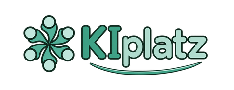
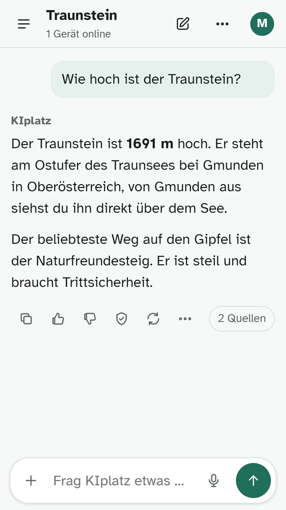
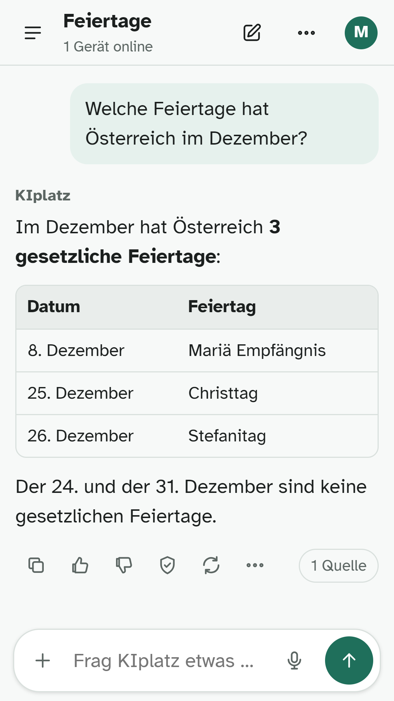
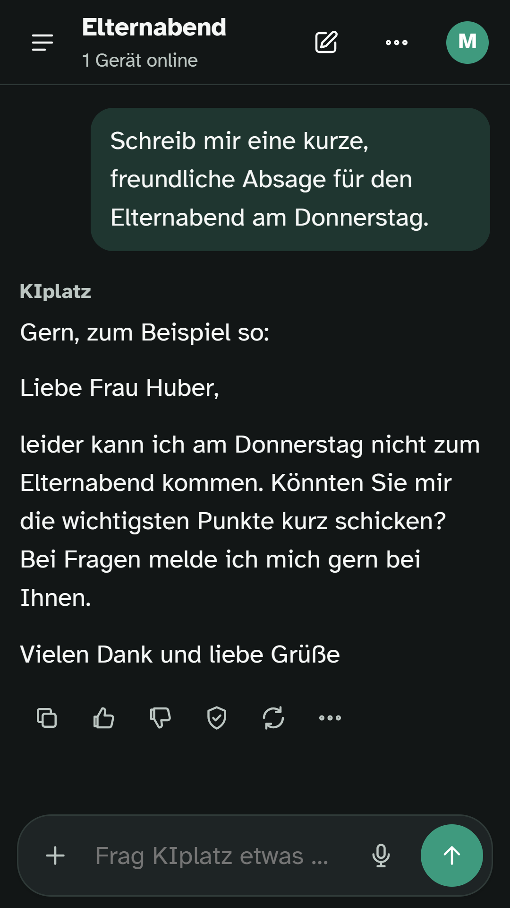
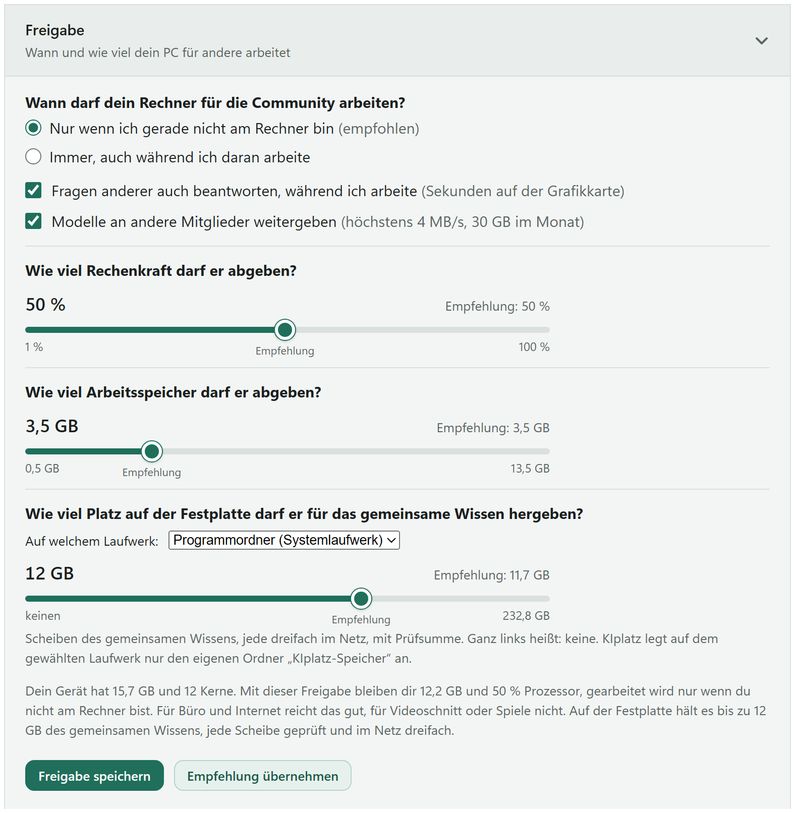
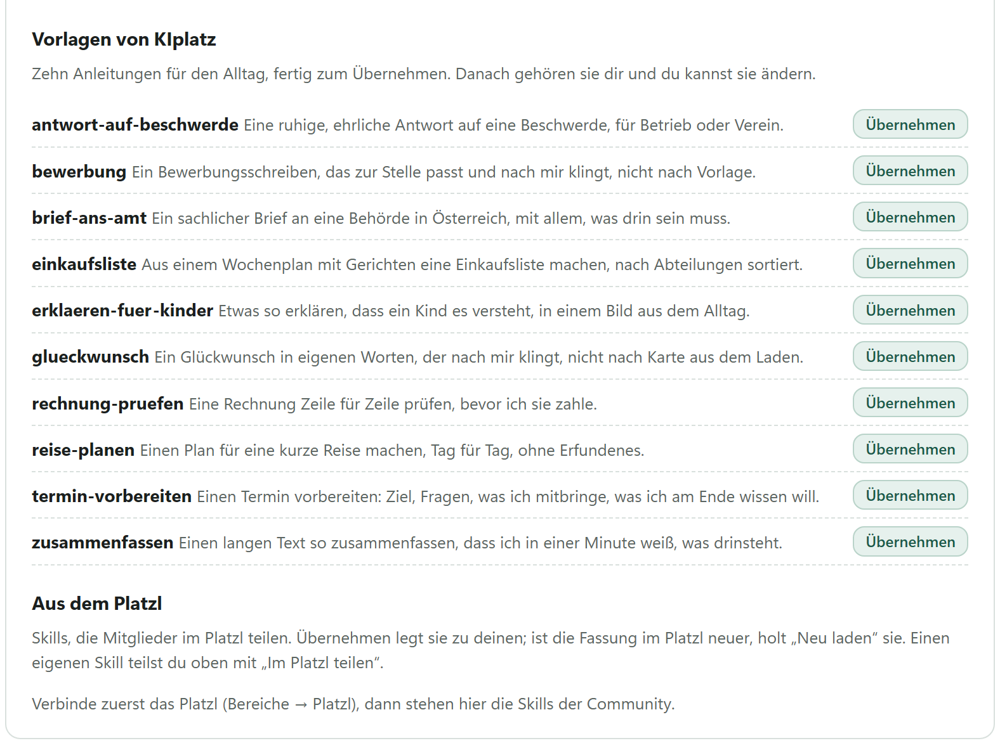

  <a href="https://kiplatz.at/">
    <picture>
      <source media="(prefers-color-scheme: dark)" srcset="bilder/logo-480-dunkel.png">
      
    </picture>
  </a>

# KIplatz

**Eine KI, die ihrer Community gehört.** Die Antworten erarbeiten die PCs der Mitglieder, nicht ein Rechenzentrum. Der Server in Wien vermittelt nur. Der PC, der deine Frage beantwortet, weiß nicht, wer du bist.

[kiplatz.at](https://kiplatz.at/) · [Programm holen](https://kiplatz.at/rechenkraft-teilen/) · [Am Handy](https://kiplatz.at/app/) · [Mitreden im Platzl](https://forum.kiplatz.at/) · [Mitbauen in der Werkstatt](https://werkstatt.kiplatz.at/) · [Wiki](https://kiplatz.at/wiki/)

## Antworten von den PCs der Mitglieder

- Jeder PC, der mitmacht, arbeitet für die Community, wenn er sonst nichts zu tun hat. Auch das gemeinsame Wissen liegt bei den Mitgliedern, und neue Mitglieder holen ihre KI zuerst von anderen PCs der Community, verschlüsselt und Stück für Stück geprüft.
- Unter der Antwort steht, woher sie kommt. Weiß KIplatz etwas nicht, sagt es das, statt etwas zu erfinden.
- Gespräche, Gedächtnis und Dateien liegen auf deinem Gerät. E-Mail-Adressen, Telefonnummern und Kontonummern löscht der Server aus einer Frage, bevor sie an einen PC der Community geht. Allgemeine Wissensfragen und ihre geprüften Antworten heben wir verschlüsselt und ohne Namen auf, damit die nächste gleiche Frage sofort beantwortet ist. Daraus lernt KIplatz auch, [offen nachlesbar](https://kiplatz.at/so-lernt-kiplatz/); wer das nicht will, schaltet „Meine Fragen helfen beim Lernen“ aus. Alles dazu in der [Datenschutzerklärung](https://kiplatz.at/datenschutz/).
- Am Handy fragst du unter [kiplatz.at/app](https://kiplatz.at/app/), und mit „Frag dein Zuhause“ holst du dir Dateien vom PC daheim, ohne Cloud.
- Was dein Rechner für andere erarbeitet, steht in der [Bestenliste](https://kiplatz.at/bestenliste/), gern mit deinem Team aus Verein, Schule oder Freundeskreis. Die Zahlen der ganzen Community stehen in der [Statistik](https://kiplatz.at/statistik/).
- Der Server steht in Wien, Sprache und Wissen sind für Österreich, Deutschland und die Schweiz gemacht. Programm und App gibt es auf Deutsch und Englisch.

Wie das im Einzelnen funktioniert, steht im [Wiki](https://kiplatz.at/wiki/so-funktioniert-es/). Was nie passiert, steht auf [Was nie passiert](https://kiplatz.at/was-nie-passiert/).

## Am Handy und am PC

Am Handy: eine Frage mit Quelle, eine Antwort als Tabelle, ein Brief im dunklen Modus.

  
  
  

Am PC entscheidest du selbst, wann und wie viel dein Rechner für die Community arbeitet. Skills übernimmst du mit einem Klick.

  
  

## Mitbauen passiert bei uns

Hier auf GitHub liegt nur das Schaufenster. Gebaut und geredet wird auf unseren eigenen Plätzen, mit einem Konto für alles.

| | Wo | Was du dort machst |
|---|---|---|
| **Mitreden** | [Platzl](https://forum.kiplatz.at/) | Fragen stellen, Tipps teilen, Skills schreiben und gemeinsam verbessern, eine Gruppe für Hochschule, Verein oder Hobby gründen |
| **Mitbauen** | [Werkstatt](https://werkstatt.kiplatz.at/KIplatz/mitbauen) | Fehler melden, Ideen einbringen, Quellen vorschlagen, die Anleitungen verbessern, mit Vorlagen für alles |
| **Mithelfen** | [Mithelfen](https://kiplatz.at/mitarbeit-gesucht/) | Testen, übersetzen, das Wiki verbessern oder den eigenen PC für die Community arbeiten lassen |

**Konto:** kostenlos, mit E-Mail-Adresse oder Google, gilt für Platzl, Werkstatt und Programm. [Konto anlegen](https://werkstatt.kiplatz.at/user/sign_up)

### Vom ersten Skill bis zum Bauteil

| Stufe | Was du tust | Wo es sichtbar wird |
|---|---|---|
| 1 | Regeln als Skill schreiben und teilen | Skill-Sammlung im Platzl |
| 2 | Einen Fehler melden | Fehler der Woche, Antwort auf deine Meldung |
| 3 | Eine Quelle einbringen | gemeinsames Wissen |
| 4 | Eine Behebung oder Prüfung vorschlagen | eigene Meldung, Neuigkeiten |
| 5 | Ein Bauteil mitbauen | Jahresbrief |

Programmieren musst du dafür nicht können, ein Skill ist in 10 Minuten geschrieben: [Vorlage und Anleitung](skills/SKILL-SCHREIBEN.md). Wer etwas beiträgt, steht auf Wunsch mit Namen auf [Wer mitbaut](https://kiplatz.at/wer-mitbaut/). Die ganze Anleitung steht im [Wiki, Kapitel Mitbauen](https://kiplatz.at/wiki/mitbauen/).

**Eine Sicherheitslücke gefunden?** Bitte vertraulich, siehe [SECURITY.md](SECURITY.md).

## Skills, Werkzeuge und Doku in diesem Repository

| Ordner | Inhalt |
|---|---|
| [`skills`](skills/) | Fertige Skills zum Verwenden und Verbessern, etwa „Brief ans Amt“ oder „Rechnung prüfen“, dazu die [Vorlage für deinen eigenen](skills/SKILL-SCHREIBEN.md) |
| [`docs`](docs/) | [Erste Schritte](docs/hilfe.md) mit Verweisen ins Wiki und die KI-Schnittstelle am eigenen PC im Format von OpenAI |
| [`werkzeuge`](werkzeuge/) | Hardware-Check („Was schafft mein PC?“), Skill-Prüfer und Anleitungen für Continue, Open WebUI und Jan |
| [`NEUERUNGEN.md`](NEUERUNGEN.md) | Was jede Version des Programms neu kann, in den Sätzen, die das Programm nach einem Update zeigt |

Der Quelltext von Programm und Server liegt nicht hier. Das Programm kommt fertig gebaut und unterschrieben von [kiplatz.at](https://kiplatz.at/rechenkraft-teilen/).

## Lizenz

Texte, Anleitungen und Skills in diesem Repository stehen unter [CC BY 4.0](LICENSE). Du darfst sie frei verwenden, ändern und weitergeben, auch beruflich, solange du KIplatz als Quelle nennst und auf die Lizenz verweist. Zum Beispiel: „Skill rechnung-pruefen von KIplatz, CC BY 4.0, kiplatz.at“.

Die Code-Beispiele in [`docs`](docs/) und die [Werkzeuge](werkzeuge/) stehen unter der [MIT-Lizenz](LICENSE-CODE). Du kannst sie ohne Umstände in deine eigenen Programme übernehmen.

Nicht erfasst sind der Name KIplatz, das Logo und die Bilder im Ordner `bilder`. Die Lizenzen geben kein Recht, sie zu verwenden, etwa für ein eigenes Produkt oder Projekt. Das Programm selbst liegt nicht in diesem Repository und steht unter keiner dieser Lizenzen. Alle übrigen Rechte bleiben bei KIplatz.

---

### In English

KIplatz is an AI owned by its community. Answers come from the members' own computers, not from a data centre; the server in Vienna only passes questions on, and the computer that answers never learns who asked. This repository holds ready-to-use skills and the documentation for the local, OpenAI-compatible interface. Building happens on our own places: talk in the [Platzl](https://forum.kiplatz.at/), report bugs, ideas and sources in the [Werkstatt](https://werkstatt.kiplatz.at/KIplatz/mitbauen), one free account for everything. More at [kiplatz.at/en](https://kiplatz.at/en/).

Texts, guides and skills are licensed under [CC BY 4.0](LICENSE), code samples and the tools in `werkzeuge` under the [MIT License](LICENSE-CODE). The name KIplatz, the logo and the images in `bilder` are not covered by these licenses. The program itself is not part of this repository.
