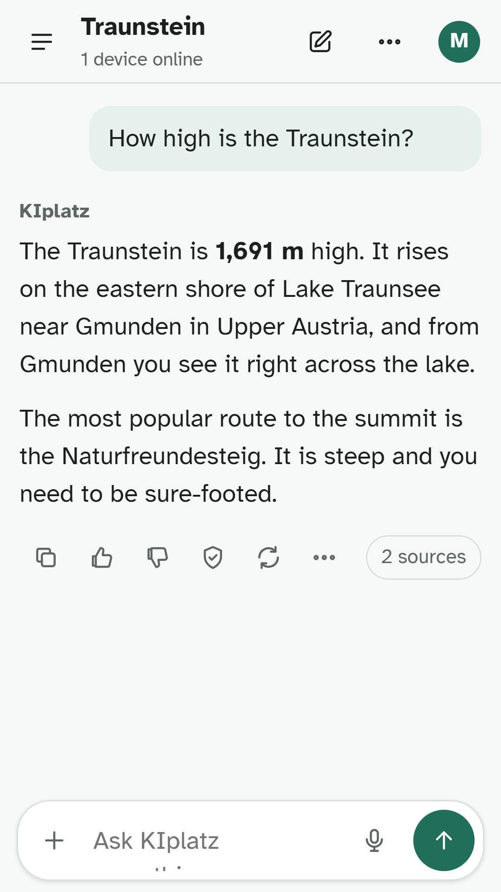
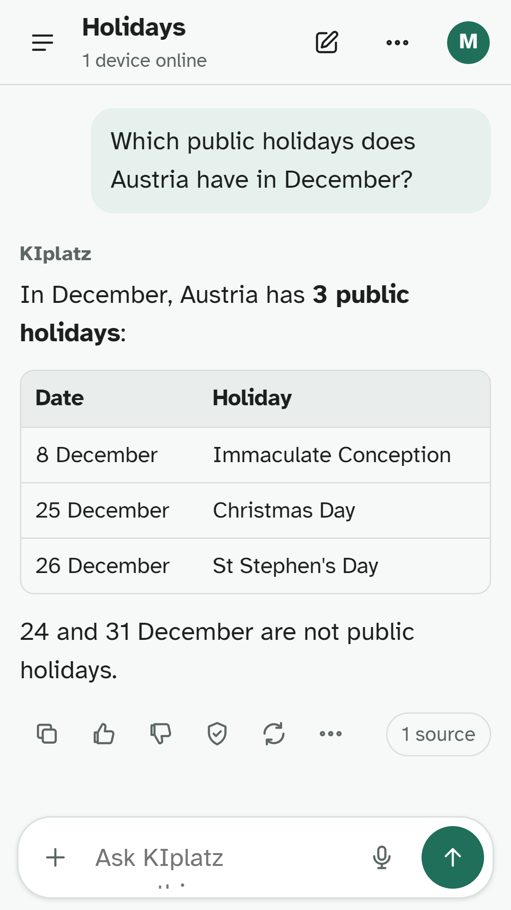
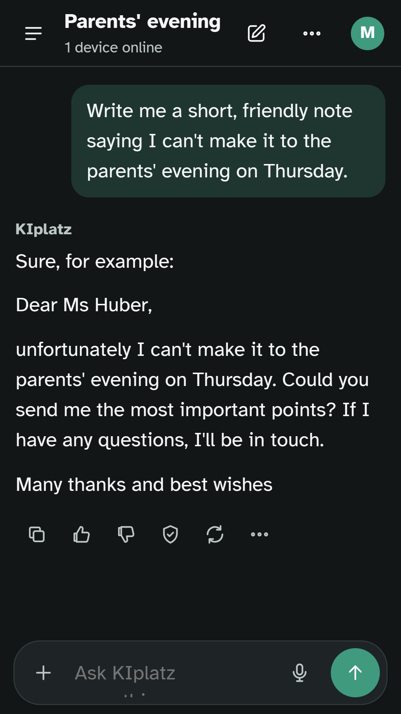
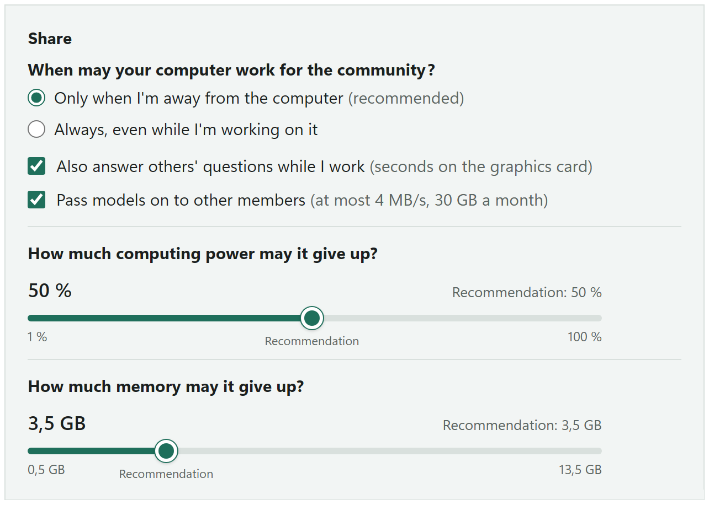

  <a href="https://kiplatz.com/">
    <picture>
      <source media="(prefers-color-scheme: dark)" srcset="bilder/logo-480-dunkel.png">
      
    </picture>
  </a>

# KIplatz: a free AI from Austria that runs on its community's PCs

**An AI that belongs to its community.** The answers are worked out by the members' own PCs, not by a data centre. The server in Vienna only passes questions on, and the PC that answers your question doesn't know who you are. (KI is German for AI.)

English · [Deutsch](README.de.md)

[kiplatz.com](https://kiplatz.com/) · [Get the program](https://kiplatz.com/share-computing/) · [On your phone](https://kiplatz.at/app/) · [Forum (Platzl)](https://forum.kiplatz.at/?tl=en) · [Workshop](https://werkstatt.kiplatz.at/KIplatz/mitbauen?lang=en-US) · [Wiki](https://kiplatz.com/wiki/)

**Testers wanted for the Android app.** Before the KIplatz app appears in the Play Store, Google requires a test: 12 people download it and use it for 14 days in everyday life. It costs nothing and you don't need any special skills. Sign up in the forum (the thread is in German): https://forum.kiplatz.at/t/kiplatz-fuer-android-wir-suchen-12-tester-fuer-unsere-app/34

  
  
  

## Answers from the members' PCs

- Every PC that takes part works for the community whenever it has nothing else to do. The shared knowledge lives with the members too, and new members first get their AI from other PCs in the community, encrypted and checked piece by piece.
- Under every answer you see where it comes from. If KIplatz doesn't know something, it says so instead of making something up.
- Chats, memory and files stay on your device. The server removes email addresses, phone numbers and account numbers from a question before it goes to a PC in the community. General knowledge questions and their checked answers are kept encrypted and without names, so the next identical question is answered right away. KIplatz also learns from them, [explained openly](https://kiplatz.com/how-kiplatz-learns/); if you don't want that, switch off "My questions help KIplatz learn". The details are in the [privacy policy](https://kiplatz.com/privacy/).
- On your phone you ask at [kiplatz.at/app](https://kiplatz.at/app/), and with "Ask your home" you get files from your PC at home, without a cloud.
- What your computer works out for others shows up on the [leaderboard](https://kiplatz.com/leaderboard/), with your team from a club, school or group of friends if you like. The figures for the whole community are in the [statistics](https://kiplatz.com/statistics/).
- The server is in Vienna, and language and knowledge are made for Austria, Germany and Switzerland. The program and the app are available in English and German.

How it all works is explained in the [wiki](https://kiplatz.com/wiki/how-it-works/). What never happens is listed on [What never happens](https://kiplatz.com/what-never-happens/).

## Your PC, your limits

The program runs on Windows 11. You decide when and how much your computer works for the community.

## Building happens on our own sites

GitHub is only our shop window. Building and talking happen on our own sites, with one account for everything.

| | Where | What you do there |
|---|---|---|
| **Talk** | [Forum (Platzl)](https://forum.kiplatz.at/?tl=en) | Ask questions, share tips, write skills and improve them together, start a group for your university, club or hobby |
| **Build** | [Workshop](https://werkstatt.kiplatz.at/KIplatz/mitbauen?lang=en-US) | Report bugs, bring in ideas, suggest sources, improve the guides, with templates for everything |
| **Help** | [Help wanted](https://kiplatz.com/help-wanted/) | Test, translate, improve the wiki or let your own PC work for the community |

**Account:** free, with an email address or Google, and it works for the forum, the workshop and the program. [Create an account](https://werkstatt.kiplatz.at/user/sign_up?lang=en-US). Most conversations there are in German so far; you're welcome to write in English.

### From your first skill to a component

| Level | What you do | Where it shows |
|---|---|---|
| 1 | Write rules as a skill and share them | Skill collection in the forum |
| 2 | Report a mistake | Mistake of the week, a reply to your report |
| 3 | Suggest a source | Shared knowledge |
| 4 | Suggest a fix or a check | Your own report, news |
| 5 | Build a component along | Annual letter |

You don't need to know how to program, a skill is written in 10 minutes: [template and guide](skills/SKILL-SCHREIBEN.md) (in German). Anyone who contributes can be listed by name on [Who builds](https://kiplatz.com/who-builds/). The full guide is in the [wiki, chapter Build along](https://kiplatz.com/wiki/build-along/).

**Found a security hole?** Please report it confidentially, see [SECURITY.md](SECURITY.md).

## Skills, tools and docs in this repository

| Folder | Contents |
|---|---|
| [`skills`](skills/) | Ready-made skills to use and improve, for example "Letter to an authority" or "Check an invoice", and the [template for your own](skills/SKILL-SCHREIBEN.md). The skills are written in German. |
| [`docs`](docs/) | [Getting started](docs/hilfe.md) with links to the wiki, and the AI interface on your own PC in OpenAI format (in German; in English in the [wiki for developers](https://kiplatz.com/wiki/for-developers/)) |
| [`werkzeuge`](werkzeuge/) | Hardware check ("What can my PC handle?"), skill checker and guides for Continue, Open WebUI and Jan (in German) |
| [Releases](https://github.com/KIplatz/kiplatz/releases) | What each version of the program brings, in English. In German: [`NEUERUNGEN.md`](NEUERUNGEN.md) |

The source code of the program and the server is not in this repository. The program comes ready-built and signed from [kiplatz.com](https://kiplatz.com/share-computing/).

## License

Texts, guides and skills in this repository are licensed under [CC BY 4.0](LICENSE). You may use, change and share them freely, also at work, as long as you name KIplatz as the source and refer to the license. For example: "Skill rechnung-pruefen by KIplatz, CC BY 4.0, kiplatz.com".

The code samples in [`docs`](docs/) and the [tools](werkzeuge/) are licensed under the [MIT License](LICENSE-CODE). You can use them in your own programs without any fuss.

Not covered are the name KIplatz, the logo and the images in the `bilder` folder. The licenses give no right to use them, for example for a product or project of your own. The program itself is not in this repository and is not covered by either license. All other rights remain with KIplatz.
